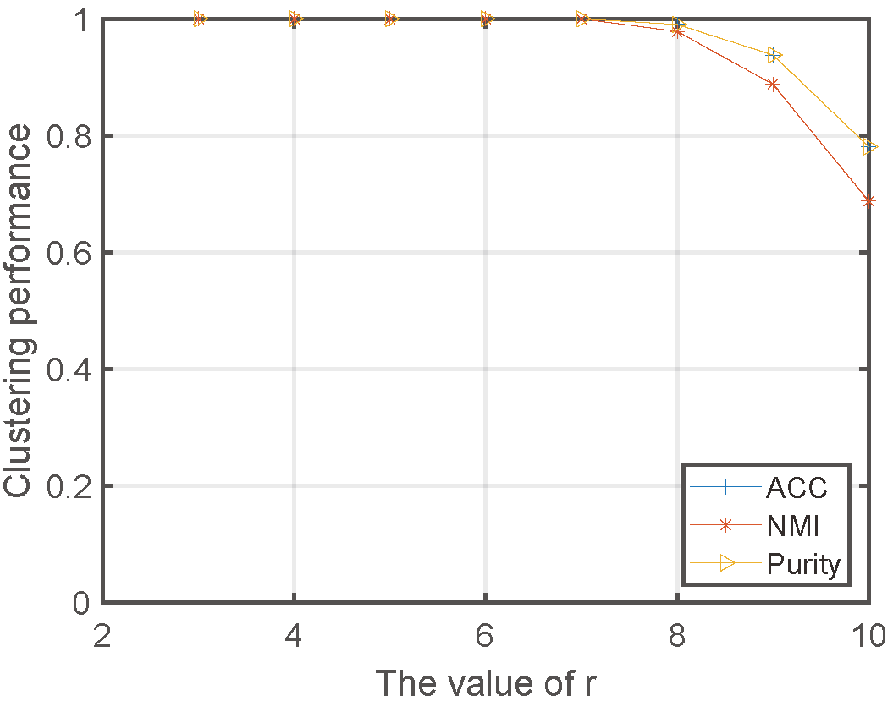
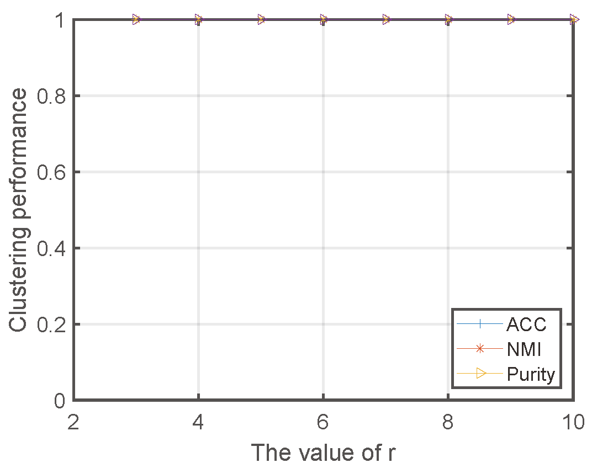
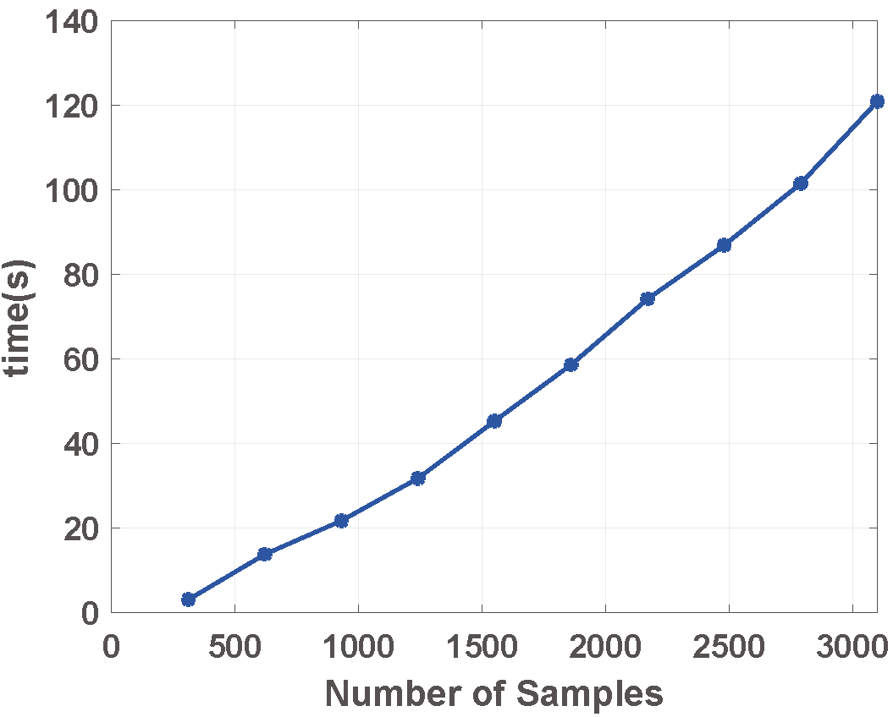

# Centerless Multi-View K-Means Based on The Adjacency Matrix

## Review2 & Review3

### Effect of parameter $r$

we change r in [3,10] on MSRC and ORL datasets, and for a fixed r, we adjust other parameters to find a great result and record in Fig.(1)

<figure class="half">
     
    
</figure>

 Fig.(1) Clustering performance vs. r on MSRC and ORL datasets  
 

## Review2

### Experiment of the computational complexity 

On NUS_WIDE datasets, we choose different number of samples to run at same number of iteration, and record the data in Fig.(2). It can be seen that the running time is linear to number of samples, which can proves that the computational complexity of our model is linear to N 

<figure align="center">
    
</figure>

 Fig.(2) the running time vs. number of samples under the same number of iterations  
 

---
